<h1 align="center">Piscine CPP</h1>

Onzième projet de [42](https://42.fr/), nombreux excercices qui ont pour but d'introduire le language C++.

Les concepts abordés sont :

- Programmation objet
- Polymorphisme
- Héritage
- Templates
- Containers
- Casting
- Try / Catch

### Lancement des exercices :

Dans chacuns des sous-repetoires, utiliser la commande :

```
make
```

---

### Intégration continue :

[](https://github.com/Florian-A/Philosophers/actions/workflows/build.yml) [](https://github.com/Florian-A/Philosophers/actions/workflows/cpplint.yml) [](https://github.com/Florian-A/Philosophers/actions/workflows/valgrind.yml)

### [CPP 00](./cpp00/)

| |
| --- |
| 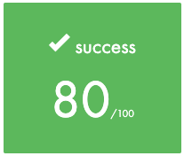 |

| | |
| --- | --- |
| Correcteur 1 | 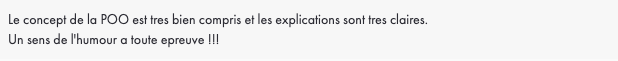 |
| Correcteur 2 | 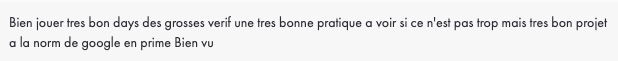 |

---

### [CPP 01](./cpp01/)

| |
| --- |
| 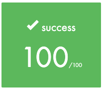 |

| | |
| --- | --- |
| Correcteur 1 |  |
| Correcteur 2 | 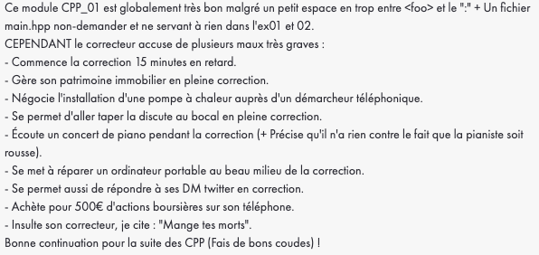 |

---

### [CPP 02](./cpp02/)

| |
| --- |
|  |

| | |
| --- | --- |
| Correcteur 1 | 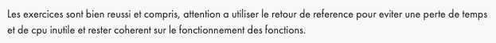 |
| Correcteur 2 | 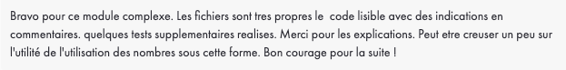 |

---

### [CPP 03](./cpp03/)

| |
| --- |
|  |

| | |
| --- | --- |
| Correcteur 1 | 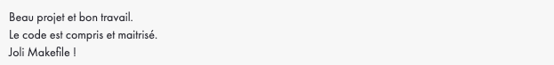 |
| Correcteur 2 | 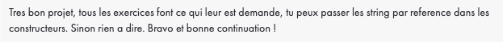 |

---

### [CPP 04](./cpp04/)

| |
| --- |
|  |

| | |
| --- | --- |
| Correcteur 1 | 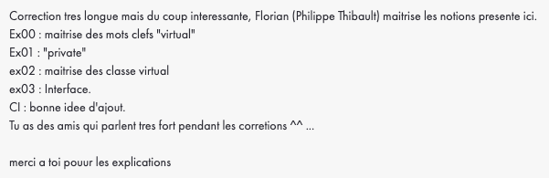 |
| Correcteur 2 |  |

---

### [CPP 05](./cpp05/)

| |
| --- |
|  |

| | |
| --- | --- |
| Correcteur 1 |  |
| Correcteur 2 |  |

---

### [CPP 06](./cpp06/)

| |
| --- |
|  |

| | |
| --- | --- |
| Correcteur 1 |  |
| Correcteur 2 |  |

---

### [CPP 07](./cpp07/)

| |
| --- |
|  |

| | |
| --- | --- |
| Correcteur 1 |  |
| Correcteur 2 | 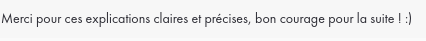 |

---

### [CPP 08](./cpp08/)

| |
| --- |
|  |

| | |
| --- | --- |
| Correcteur 1 |  |
| Correcteur 2 |  |

---

### [CPP 09](./cpp09/)

| |
| --- |
|  |

| | |
| --- | --- |
| Correcteur 1 | 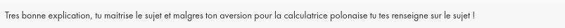 |
| Correcteur 2 |  |
| Correcteur 3 |  |
